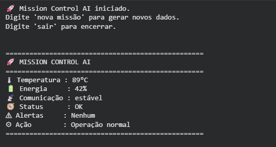
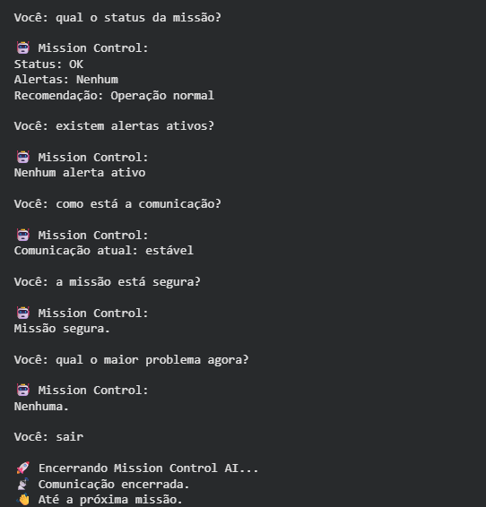

# 🚀 Mission Control AI - Space Tech

## 👨‍🚀 Integrantes

- Pedro Ribeiro Lopes — RM: 570083
- Lucas Furquim Lima — RM: 568690
- Diogo Chiaradia Santos — RM: 570246

---

## 📌 Sobre o Projeto

Sistema de monitoramento de missão espacial desenvolvido em Python com inteligência artificial.

O projeto utiliza o modelo Llama 3.2 via Ollama para analisar dados simulados de temperatura, energia e comunicação, gerando alertas automáticos e respostas inteligentes durante situações críticas da missão.

---

## 🖥️ Demonstração

### Painel da Missão

### Respostas IA

---

## ▶️ Como Executar

Abra o notebook no Google Colab:

[Acessar Notebook](https://colab.research.google.com/drive/1WJ29Tst6Jz34sHrxVQKXkKVaFMbnRgZj#scrollTo=rtfqTG4f2vp9)

Execute todas as células em ordem.

O modelo Llama será instalado automaticamente durante a execução do projeto.

---

## 🎥 Vídeo de Demonstração

[Assistir ao vídeo](COLE_O_LINK_DO_VIDEO_AQUI)
